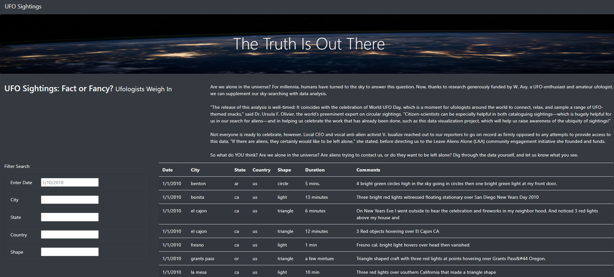
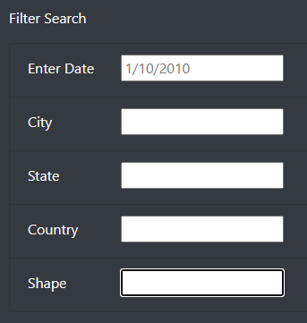
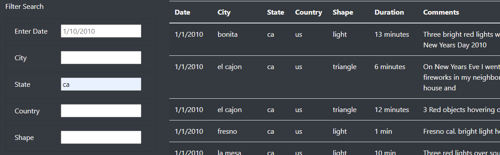
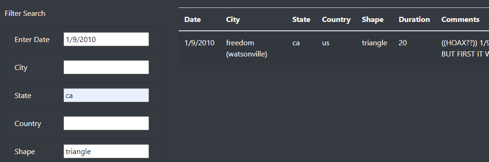
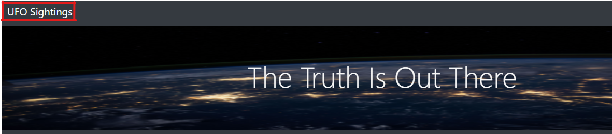

# UFOs

## Overview

This project is the 11th weekly challenge of the Data Science Bootcamp. It allows us to put into practice and showcase the skills learned in Module 11 of the bootcamp.

### Purpose

We extended the functionality of the dynamic table. It is now possible to filter the UFO data using multiple criteria. Filtering can now be performed by date, city, state, country and shape.

## Results

The following folder and files are part of the project:

- [index.html](./index.html)
- [static/css/style.css](./static/css/style.css):  css file with additional formatting.
- [static/js/app.js](./static/js/app.js): application file.
- [static/js/data.js](./static/js/data.js) data file.
- [static/images/](./static/images): folder containing images used by web file.

### Using the Filters

After opening the [index.html](./index.html) file, the user can enter values on any of the **Filter Search** input fields.

Enter a value in one of the fields and then press ***Enter*** or move to a different field. The table will change according to the filtered value.

Multiple filters can be applied by entering additional values to other input fields.

Filters can be removed one at the time by deleting the values on the input boxes or by clicking **UFO Sightings** on the navigation bar.

## Summary

The filters work as initially intended.  However as a filtering tool it has multiple shortcomings or drawbacks:

- single value filtering for each criteria. It wouldn't be possible to filter for entries in 2 states simultaneously.
- exact match filtering only. The values entered in the filter input boxes must match exactly those on the data. Including the character case and date format.

Additionally, the data is presented as it was provided by the input data file.  Some formatting may be needed for aesthetic purposes, such as proper casing text and standardisation of duration units.

### Future improvements

Here are a few ideas to work in future iterations of this project:

- allow filtering to be case insensitive.
- allow partial matches by filters to be included.
- improve filtering by dates to allow any date format to be entered.
- format the data on the table to show proper casing of states and city names.
- allow filtering by multiple values on a category.
- add an export option to save the current data selection.
